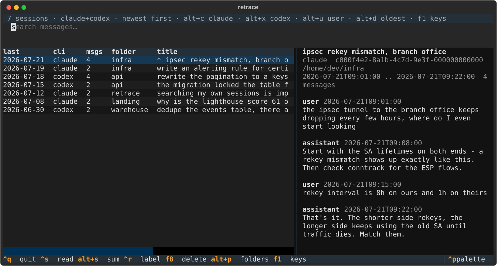
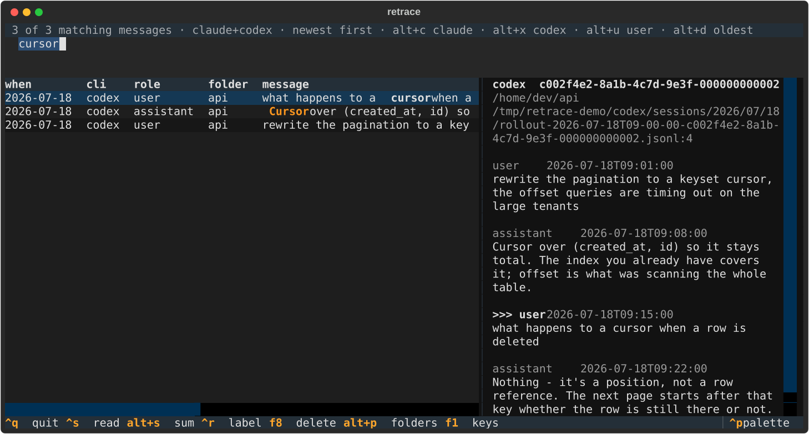

# retrace

Search, browse and manage your local Claude Code and Codex CLI sessions.

```sh
uv tool install git+https://github.com/vmax/retrace
```



<sub>Synthetic sessions — regenerate with `python docs/make_screenshot.py`. A
screenshot of the real thing is a screenshot of your own conversations.</sub>

Answers "where did I discuss X?" across every session on this machine in about a
tenth of a second, then lets you act on the answer: resume it, read it,
summarise it, label it, delete it.

```sh
retrace                       # interactive browser
retrace s "error budget"      # search, print hits
retrace s conntrack --sessions --since 2026-06-01
retrace sessions              # titled session list, newest first
retrace projects              # project folders with session/message counts
retrace show 2                # read the 2nd most recent session in $PAGER
retrace resume 2              # hand it back to claude/codex
retrace name 2 "mikrotik ipsec debugging"   # quote the label; flags go last
retrace sum 2 --label         # summarise via claude/codex, store as the label
retrace rm 2                  # delete the transcript (confirms first)
retrace index --full          # rebuild the index
retrace stats
```

## No network, no daemon, nothing leaves your machine

retrace makes no network requests, runs no background process, and has no
telemetry. Every invocation is short-lived and reads local files. The index is a
SQLite database at `~/.cache/retrace/index.db`.

The one exception is explicit and on demand: `retrace sum` pipes a transcript to
your **local** `claude` or `codex` binary, which then talks to whichever API you
have configured. Nothing else ever sends your transcripts anywhere.

retrace also **never writes to a transcript file**. It reads them, and it deletes
them when you ask it to. That is the whole set of operations.

By default the index contains only user and assistant text. `index
--include-tools` adds tool calls and their results, which means whole file reads
and terminal output — every secret an agent ever printed becomes queryable. It is
off by default for that reason.

## Retention: raise it *before* you need it

Claude Code prunes its own transcripts after `cleanupPeriodDays` (**30** by
default). retrace can only index what is still on disk, so a session deleted by
that cleanup is gone before retrace ever sees it — raising the setting now
protects future sessions, not past ones.

```jsonc
// ~/.claude/settings.json
{ "cleanupPeriodDays": 365 }
```

Codex keeps sessions under `~/.codex/sessions` without a documented expiry, but
the same logic applies: retrace is an index, not a backup.

## Interactive browser

```sh
retrace              # sessions, newest first
retrace i conntrack  # opens with the search box filled in
retrace i --projects # opens at the folder level
```

Typing searches message text with FTS5 across the whole corpus — every word is
treated as a prefix, so results appear while you type.



| key | action |
|---|---|
| <kbd>Enter</kbd> | resume the session (on a folder row: descend into it) |
| <kbd>Ctrl</kbd>+<kbd>S</kbd> | read the whole session in `$PAGER`, positioned on the hit |
| <kbd>Alt</kbd>+<kbd>S</kbd> | summarise it with claude/codex |
| <kbd>Ctrl</kbd>+<kbd>R</kbd> | rename (label) the session |
| <kbd>F8</kbd> | delete the session (confirmation dialog) |
| <kbd>Ctrl</kbd>+<kbd>O</kbd> | print the selected message and exit |
| <kbd>Alt</kbd>+<kbd>P</kbd> | switch between folder and session level |
| <kbd>Alt</kbd>+<kbd>A</kbd> / <kbd>Alt</kbd>+<kbd>C</kbd> / <kbd>Alt</kbd>+<kbd>X</kbd> | source: all / claude / codex |
| <kbd>Alt</kbd>+<kbd>U</kbd> | cycle role filter: any → user → assistant |
| <kbd>Alt</kbd>+<kbd>D</kbd> | flip newest ⇄ oldest |
| <kbd>Escape</kbd> | clear the query, then the filters — never exits |
| <kbd>Ctrl</kbd>+<kbd>Q</kbd> | quit |
| <kbd>F1</kbd> | key help |

The search box is a text field, so it owns the editing keys:
<kbd>Ctrl</kbd>+<kbd>C</kbd> copy, <kbd>Ctrl</kbd>+<kbd>X</kbd> cut,
<kbd>Ctrl</kbd>+<kbd>V</kbd> paste, <kbd>Ctrl</kbd>+<kbd>U</kbd> clear the line,
<kbd>Ctrl</kbd>+<kbd>W</kbd> delete a word. That means
<kbd>Ctrl</kbd>+<kbd>C</kbd> does **not** quit while you are typing — use
<kbd>Ctrl</kbd>+<kbd>Q</kbd>. <kbd>Escape</kbd> clears; it never exits, because
it is the key you hit reflexively after a mistyped search.

Delete is <kbd>F8</kbd>: <kbd>Ctrl</kbd>+<kbd>X</kbd> and
<kbd>Ctrl</kbd>+<kbd>D</kbd> are both text-editing keys the search box consumes
first, and <kbd>Ctrl</kbd>+<kbd>X</kbd> would also sit next to "filter to codex",
which is a bad neighbour for a delete key.

## Addressing a session

`show`, `resume`, `rm`, `name` and `sum` all take the same reference:

`--source` and `--project` narrow the search, ordinals included: `retrace rm 1
--source codex` is the newest *codex* session, not the newest session overall.

* nothing — the most recent session
* an ordinal — `1` is newest, `2` the one before
* a session id, or a prefix of one
* any substring of the path, project, your label, or a CLI-set name

If more than one session matches, retrace prints the candidates and exits 1. It
never guesses.

## Searching

The query is FTS5. Plain words are quoted for you and treated as prefixes, so
`retrace s kube-proxy` and `retrace s mik` both work. Use `--exact` for
whole-token matching. If the query contains `AND`, `OR`, `NOT`, `NEAR(`, `^`, `:`
or a double quote, it is passed through as FTS5 syntax verbatim.

Results are newest-first by default, so a broad query returns the most *recent*
matches rather than the best ones — `--sort rank` (bm25) when you want relevance,
`--sort old` for the other end of the range.

Tokenisation is `unicode61 remove_diacritics 2`, which handles Cyrillic. There is
no stemming in any language; prefix matching partly compensates.

**Names are not message text**, so FTS5 cannot match them — a search runs both.
Sessions whose name, label, id or path matches are listed first, above the
messages that merely mention the words, in the CLI and in the browser alike. So a
session you renamed is findable by its name whether or not anyone ever typed that
name into a conversation.

## Environment

| var | default | effect |
|---|---|---|
| `RETRACE_DB` | `~/.cache/retrace/index.db` | index location |
| `RETRACE_CLAUDE_ROOT` | `~/.claude/projects` | transcript root |
| `RETRACE_CODEX_ROOT` | `~/.codex/sessions` | transcript root |
| `RETRACE_CODEX_INDEX` | `~/.codex/session_index.jsonl` | where Codex keeps session names |
| `RETRACE_NO_AUTO` | unset | disable the freshness pass before queries |
| `RETRACE_VERBOSE` | unset | list unparseable entries after indexing |
| `RETRACE_PAGER` / `PAGER` | `less` | pager (`-R +N` added only for `less`) |
| `RETRACE_CLAUDE_RESUME` | `claude --resume {id}` | resume template |
| `RETRACE_CODEX_RESUME` | `codex resume {id}` | resume template |
| `RETRACE_CLAUDE_SUMMARIZE` | `claude -p --no-session-persistence {prompt}` | summarise template |
| `RETRACE_CODEX_SUMMARIZE` | `codex exec --ephemeral --skip-git-repo-check -s read-only {prompt}` | summarise template |
| `RETRACE_SUMMARY_PROMPT` | built-in | summarisation instruction |
| `RETRACE_SUMMARY_MAX` | `400000` | chars sent; head+tail clamp above this |
| `RETRACE_SUMMARY_TIMEOUT` | `600` | seconds |
| `RETRACE_SUMMARY_CWD` | unset | working directory for the summarise child |

Templates are `shlex.split` and then `.format()`ed, so `{prompt}` stays a single
argv element however many spaces it contains.

## Measured

On a real corpus of 475 sessions / 20,685 messages (a 54 MB index):

| operation | time |
|---|---|
| `retrace s foo`, whole command, cold interpreter | 60–95 ms |
| keystroke in the browser, typical query | 3–20 ms |
| keystroke, one-letter prefix matching 14k messages | ~33 ms |
| session list, all 475, uncapped | 78 ms |
| folder list | 16 ms |
| no-op incremental index | 11 ms |
| cold index of the whole corpus | 3.1 s |

The browser holds one connection and queries in-process, which is where most of
that comes from — a design that forks a process per keystroke pays ~60 ms of
interpreter start-up before it touches the database.

One deliberate bound: a keystroke fetches at most 500 matching messages, because
a one-letter prefix matches thousands and ordering them all costs half a second.
The status line always says `N of M matching messages`, so a truncated list says
so. Session and folder listings are not capped.

## Known unknowns

Things this tool assumes but cannot verify from the outside, each with a way out:

* **`codex resume <id>` is the right invocation.** If it is not,
  `RETRACE_CODEX_RESUME` is a template.
* **`codex exec` uses stdin as context.** It certainly *reads* stdin; that it
  treats it as conversation context is inferred. `sum --with claude` switches
  engines, and a failing child is always reported rather than silently labelled.
* **CLI-set session names may not be in the JSONL at all.** If absent, titles fall
  back to the first real user message; nothing breaks.
* **`suspend()`/restore.** Pinned Textual, and a failure to hand over the terminal
  produces an error toast instead of a dead terminal.

## How it works

Searching runs an incremental index pass first, so results are never stale: one
`stat()` per transcript, and reads only of files that grew. A no-op pass over a
60k-message corpus takes tens of milliseconds.

Transcripts are append-only JSONL, and both CLIs document the entry format as
internal and subject to change between releases. So the parser asserts no layout:
it walks for text-bearing shapes, coerces every value bound for a column, and a
line it cannot make sense of is counted rather than fatal. `retrace index` tells
you how many were skipped; `RETRACE_VERBOSE=1` lists them.

## Names

Both CLIs can name a session, and retrace reads both — they are just kept in
different places:

* **Claude Code** records `/rename` in the transcript itself, as a command entry.
  It can be anywhere in the file (a rename usually happens once the session has a
  subject), so retrace picks it up while indexing rather than by peeking at the
  start of the file. Last rename wins.
* **Codex** keeps names in `~/.codex/session_index.jsonl`, beside the sessions
  directory rather than in them, keyed by the same id `codex resume` takes.

`retrace name` is separate: it stores a label in retrace's own database, and a
label wins over a CLI-set name. Nothing is ever written to a transcript to change
a display string — a label is findable, shown with a `*`, and `retrace sum
<ref> --label` writes a one-line summary into it.

Resuming chdirs into the directory the session **started** in, which is not
always the last directory it was in: a session that runs `cd` keeps its transcript
where it began, and `claude --resume` only looks in the current directory's
project. Getting this wrong is what produces `No conversation found with session
ID` for a session you can plainly read.

## Development

```sh
git clone https://github.com/vmax/retrace && cd retrace
uv sync --extra dev
uv run pytest
uv tool install --reinstall .   # --reinstall: the version is unchanged, so uv
                                # would otherwise serve a cached wheel
```

Textual is pinned to an exact version on purpose: `App.suspend()` (which retrace
uses to hand the terminal to `$PAGER` and to `claude`/`codex`) has regressed
across minor releases, and that failure mode leaves a wedged terminal.

The suite runs without `claude`, `codex` or `less` installed — everything that
shells out is tested against recording stub binaries.

## Licence

MIT.
